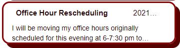
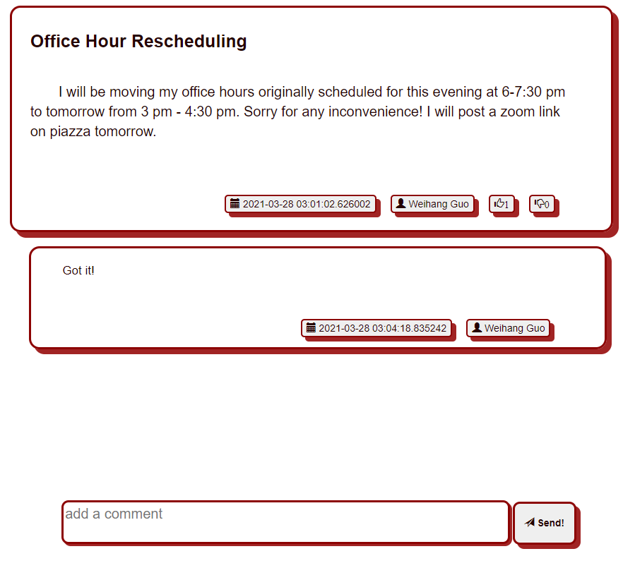
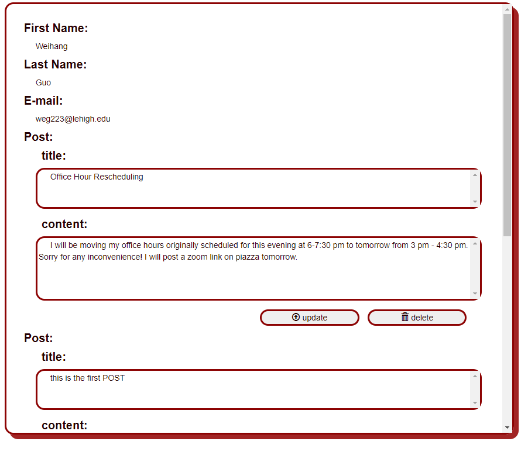
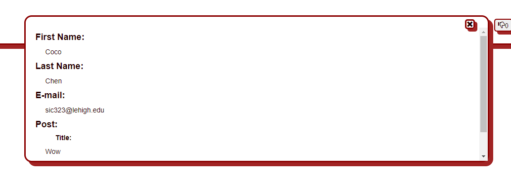

# Web

## Front-end Role
- Phase 1: Wei Zheng
- Phase 2: Weihang Guo
- Phase 3: Siyu(Coco) Chen
- Phase 4: Haocheng Gao

## Introduction 

User can login using google account in login.html. After login, the user will be redirected to index.html.

In general, the front end's UI have two parts: left part and right part. Left part include 1) new post button 2) user information button 3) a list of brief posts. The right part will show corresponding interface when different operation is done on the left part. For example, when the user click the new post button, new post interface will be showed on the right. 

***

## Dependencies
There are three types of dependencies used in this project: the deployed node
modules, the undeployed node modules, and the URLs embedded in HTML pages.

We have installed Bootstrap, Handlebars, jQuery as modules that will be deployed
onto the Heroku server. They contribute to CSS templating, html templating, and 
serve as function library. Jasmine is used for unit testing and is also deployed
to the server.

TypeScript and simple http server are installed as undeploed modules. They are
the develop tools we used during this project.

We have also linked other external sources, like google's oAuth API, into our html.
Please view them in the `head` secion of `login.html` and `index.html`.

***

## Refactorization
For maintainability and future developments, the Buzz front-end is refactored in
Phase4 to eliminate the technical debts on record. Here is a listing of all debts
accumulated through the course of development, and how they are resolved.


### Adding Handlebars for BasicStructure
`BasicStructure` is the foundamental skeleton of the Buzz front-end. It was
embedded in `index.html` originally. To extend the templating design with
handlebars to its maximum potential, these skeleton elements are moved to
`BasicStructure.hbr` and a function call to its loaded is run in the main
function of `app.ts`.

This part of refactorization improves the readability of the project by letting
each module having its own template file, stylesheet and script file instead of
hard coding anything into the html page.


### Redo the CSS of NewPostBlock
NewPostBlock follows a very simple flow-layout, meaning each component in the
layout would share most of their style attributes. However the original CSS
design heavily utilized the `position` attribute and the offset settings that
comes with it. Although it worked in previous phases, the complexity of the
stylesheets increases very fast as we extend the module.

Therefore the CSS of this module is re-designed with extensive uses of margins,
paddings, flex-boxes and height constraints. To add new components to the module,
we can simply insert new container into its DOM tree then define the height
constrain of the new container.


### Global CSS definitions
There are patterns that show up repeatedly through the application. For instance,
the shaded red border, the CSS effect upon mouse clicks, the file containers,
etc. `BasicStructure.css` was initially desinged not only to define the style
information of the document skeleton, but also to contain some global CSS class
definitions.  However, through the course of developing, this file is rarely
edited and has become out-dated. There are more grouped style attributes that
could be extracted into this global file.

By creating `mybtn` class in the global css file, we don't need to specify the
same border pattern and CSS effect over buttons over and over again when
extending the application.


### Wrapping console.log
In previous implementations, the script functions are flooded with `console.log`
output functions which will print something to the console in debug mode. There
are countless `if` branches inserted and they make the code unreadable.

I 

***

## Functions

To avoid mess up, all functions are writtern in 6 ts files. 5 of them are in the ts fold and one is app.ts. When deploying functions, `node_modules/typescript/bin/tsc app.ts --strict --outFile $TARGETFOLDER/$WEBFOLDERNAME/app.js` in deploy.sh will combine all ts file into one app.js file. Hence in index.html, only app.js is loaded. 

All the function in ts files are static. To call a function, use `ClassName.functionName()`

For the same reason, we seperate CSS file into 6 files under fold css. `cat css/BasicStructure.css css/postBrief.css css/PostCommentBlock.css css/NewPostBlock.css css/MyprofileBlock.css css/OtherProfileBlock.css> $TARGETFOLDER/$WEBFOLDERNAME/app.css` will merge all css file into app.css. index.html only load app.css.

***

## Communicate with Server
`$ajax` is used to send request and process response in the web.
```javascript
 $.ajax({
    type: "GET",
    url: backendUrl + "/api/auth",
    dataType: "json",
    data: JSON.stringify({ "idToken": id_token }),
    success: function (result:any) {
        alert("login successfully.");
        window.location.replace(backendUrl+"/index.html");
        sessionStorage.setItem('sessionKey', result.sessionKey);
    }
});
```
This function is called in login.html, which is send the id_token to backend. If the id token is valid, the server will return a session key, and then we will jump to index.html. To store the session key, session storage is used. 
```javascript
BasicStructure.sessionKey = sessionStorage.getItem("sessionKey");
```
In the index.html, session is stored in BasicStructure.sessionKey. Each time the front end send request to server, seesion key will be included. 

**The following functions are in BriefPostsList.ts**
```javascript
$.ajax({
    type: "GET",
    url: backendUrl + "/api/posts"+"/"+BasicStructure.sessionKey,
    dataType: "json",
    success: function(result:any){
        BriefPostsList.update(result);
        PostCommentBlock.update(result);
    }
});

...

class BriefPostsList {
    private static update(data:any){

        ...

        $("#left-part").append(Handlebars.templates['BriefPostsList.hb'](data));

        ...

    }
}

...

class PostCommentBlock {
    public static update(data:any){

        ...

        $("#right-part").append(Handlebars.templates['PostCommentBlock.hb'](data));

        ...

    }
}
```
This function will get all posts, all comments, and whether the user like/dislike each posts. In and ONLY in this function, the value of sessionKey will be checked. If the session key is "", which means the user may visit the index.html directly without login, the application will redirect the user to login.html. If the user has login, two update functions are called. In the update function, handlebars will help us to load the information to screen. 

**The following functions are from MyProfileBlock.ts**
```javascript
 $.ajax({
    type: "GET",
    url: backendUrl + "/api/users/my"+"/"+BasicStructure.sessionKey,
    dataType: "json",
    success: function (result: any) {
        console.log(result);
        MyProfileBlock.update(result);
    }

    ...
    private static update(data: any){
    
        ...

        $("#right-part").append(Handlebars.templates['MyProfileBlock.hb'](data));

        ...

    }
});
```
This function will get "my" own information including my first name, last name, email, all posts and comment I sent. If success, the response will be processed by handlebars and posted to screen. 

```javascript
private static updatePost() {
        
    ...

    $.ajax({
        type: "PUT",
        url: backendUrl + "/api/posts/" + mID+"/"+BasicStructure.sessionKey,
        dataType: "json",
        data: JSON.stringify({
            "title": newTitle, "content": newContent
        }),
        success: function (result: any) {
            console.log(result);
            // refresh all posts and comments
            MyProfileBlock.refresh();
        }
    });
}

private static deletePost(){
    
    ...

    $.ajax({
        type: "DELETE",
        url: backendUrl + "/api/posts/" + mID+"/"+BasicStructure.sessionKey,
        dataType: "json",
        success: function (result: any) {
            MyProfileBlock.refresh();
        }
    });
}

private static updateComment() {

    ...

    $.ajax({
        type: "PUT",
        url: backendUrl + "/api/posts/" + mPID + "/comments/" + mCID+"/"+BasicStructure.sessionKey,
        dataType: "json",
        data: JSON.stringify({
            "content": newContent
        }),
        success: function (result: any) {
            console.log(result);
            MyProfileBlock.refresh();
        }
    });
}

private static deleteComment() {
        
        ...

        $.ajax({
            type: "DELETE",
            url: backendUrl + "/api/posts/" + mPID + "/comments/" + mCID+"/"+BasicStructure.sessionKey,,
            dataType: "json",
            success: function (result: any) {
                console.log(result);
                MyProfileBlock.refresh();
            }
        });
    }
```
Those functions are 1) edit a post 2) delete a post 3) edit a comment 4) delete a comment. If success, `MyProfileBlock.refresh();` is called to ensure all posts and comments are up to date.

**The following functions are from NewPostBlock.ts**
```javascript
private static sendPost(){
        
    ...
    
    $.ajax({
        type: "POST",
        url: backendUrl + "/api/posts"+"/"+BasicStructure.sessionKey,
        dataType: "json",
        data: JSON.stringify({
            "title": newTitle, "content": newContent}),
        success: function(result:any){
            
            ...

            BriefPostsList.refresh();

            ...

        }
    });
}
```
This function will send a new post to backend. If success, `MyProfileBlock.refresh();` is called to ensure all posts and comments are up to date.

**The following functions are from PostCommentBlock.ts**
```javascript
$.ajax({
    type: "PUT",
    url: backendUrl + "/api/posts/" + postID + "/vote"+"/"+BasicStructure.sessionKey,
    dataType: "json",
    data: JSON.stringify({
        "upvote": 0, "downvote": 0
    }),
    success: function (result: any) {
        
        ...

    }
});
```
This function will send user's attitude to a post: up vote/ down vote/ neutral.

**Note that state check is performed in front end**

|               | user click | like    | dislike |
|:-------------:|:----------:|:-------:|:-------:|
| current state |            |         |         |
| neutral       |            | like    | dislike |
| like          |            | neutral | dislike |
| dislike       |            | like    | neutral |

```javascript
private static getOtherProfile() {
 
    ...

    $.ajax({
        type: "GET",
        url: backendUrl + "/api/users/" + userID+"/"+BasicStructure.sessionKey,
        dataType: "json",
        success: function (result: any) {
            PostCommentBlock.showOtherProfile(result);

        }
    });
    
}

private static showOtherProfile(data: any) {

    ...

    $("#right-part").append(Handlebars.templates['OtherProfileBlock.hb'](data));

    ...
}
```
This function will request other user's information including first name, last name, email, all posts, and all comments. 

**more documentations are in ts files**

***
## UI & Handlebars


```handlebars
{{#each mData}}
<div class="post-brief-block" data-value="{{this.mPostID}}">
    <div class="upper-information">

        <div class="title">
            <!-- leave post title here -->
            {{this.mTitle}}
        </div>

        <div class="date">
            <!-- leave post date here -->
            {{this.mDate}}
        </div>
        {{#if this.mPinned}}
            <span class="glyphicon glyphicon-pushpin pin-icon">
            </span>
        {{/if}}
    </div>

    <div class="content">
        <!-- leave post content here -->
        {{this.mContent}}
    </div>

</div>
{{/each}}
```
This handlebars will load the "api/posts/:sessionKey" information to the left view.

***
***


```handlebars
{{#each mData}}
    <div class="post-comment-view"  data-value="{{this.mPostID}}">
        <div class="post-comment-block">
            <div class="post-detail-block" value-postid="">
                <div class="title">
                    <!-- leave comment's title here -->
                    {{this.mTitle}}
                </div>
                <div class="content">
                    <!-- leave comment's content here -->
                    {{this.mContent}}
                </div>

                <div class="lower-information">

                    <button id="my-down-vote-button{{this.mPostID}}" class="dislike-button little-button my-down-vote-button my-vote-{{mUserDownVote}}"
                        data-postid="{{this.mPostID}}" data-downvotestate="{{mUserDownVote}}">
                        <!-- leave down vote count of this post here -->
                        <span id="my-down-vote-count{{this.mPostID}}" class="glyphicon glyphicon-thumbs-down">{{this.mDownVote}}
                            
                            
                        </span>    
                    </button>

                    <button id="my-up-vote-button{{this.mPostID}}" class="like-button little-button my-up-vote-button my-vote-{{mUserUpVote}}" 
                        data-postid="{{this.mPostID}}" data-upvotestate="{{mUserUpVote}}">
                        <!-- leave up vote count of this post here -->
                        <span id="my-up-vote-count{{this.mPostID}}" class="glyphicon glyphicon-thumbs-up">{{this.mUpVote}}
                            
                        </span>
                        
                    </button>

                    <button class="user-button little-button" data-value="{{this.mUserID}}">
                        <span class="glyphicon glyphicon-user"></span>
                        <!-- leave post's user here -->
                        {{this.mUserFirstName}} {{this.mUserLastName}}
                    </button>

                    <button class="date-button little-button">
                        <span class="glyphicon glyphicon-calendar"></span>
                        <!-- leave post's date here -->
                        {{this.mDate}}
                    </button>


                </div>
            </div>

            {{#each this.mComments}}
                <div class="comment-block" data-value="{{this.mCommentID}}">
                    <div class="content">
                        <!-- leave comment's content here -->
                        {{this.mContent}}
                    </div>

                    <div class="lower-information">

                        <button class="user-button little-button" data-value="{{this.mUserID}}">
                            <span class="glyphicon glyphicon-user"></span>
                            <!-- leave comment's user here -->
                            {{this.mFirstName}} {{this.mLastName}}
                        </button>

                        <button class="date-button little-button">
                            <span class="glyphicon glyphicon-calendar"></span>
                            <!-- leave commnet's post date here -->
                            {{this.mDate}}
                        </button>

                    </div>
                </div>
            {{/each}}
        </div>
        <div class="add-comment-block">
            <textarea id="my-new-comment-content{{this.mPostID}}" class="comment-input" placeholder="add a comment"></textarea>
            <button class="send-comment" data-value="{{this.mPostID}}">
                <span class="glyphicon glyphicon-send"></span>
                Send!
            </button>
        </div>
    </div>
{{/each}}
```
This handlebars will load the response from "api/posts/:seesionKey" to the right view, which will including more detail about the post and comments.

***
***


```handlebars
{{#with mData}}
<div class="my-user-profile-block">
    <h4 style="margin-top: 30px;">First Name:</h4>
    <p>{{this.mFirstName}}</p>
    <h4>Last Name:</h4>
    <p>{{this.mLastName}}</p>
    <h4>E-mail:</h4>
    <p>{{this.mEmail}}</p>

    {{#each this.mPosts}}
        <h4>Post: </h4>
        <h5>title: </h5>
        <textarea name="" id="post-title{{this.mPostID}}" cols="30" rows="3" class="edit-place">{{this.mTitle}}</textarea>
        <h5>content: </h5>
        <textarea name="" id="post-content{{this.mPostID}}" cols="30" rows="5" class="edit-place">{{this.mContent}}</textarea>
        <button class="post-update-button edit-button" data-value="{{this.mPostID}}">
            <span class="glyphicon glyphicon-upload"></span>
            update
        </button>

        <button class="post-delete-button edit-button"  data-value="{{this.mPostID}}">
            <span class="glyphicon glyphicon-trash"></span>
            delete
        </button>
    {{/each}}
     
    {{#each this.mComments}}
        <h4>Comment: </h4>
        <h5>content: </h5>
        <textarea name="" id="comment-content{{this.mCommentID}}" cols="30" rows="5" class="edit-place">{{this.mContent}}</textarea>
        <button class="comment-update-button edit-button" data-value="{{this.mCommentID}}" data-postid="{{this.mPostID}}">
            <span class="glyphicon glyphicon-upload"></span>
            update
        </button>
        <button class="comment-delete-button edit-button" data-value="{{this.mCommentID}}" data-postid="{{this.mPostID}}">
            <span class="glyphicon glyphicon-trash"></span>
            delete
        </button>
    {{/each}}
</div>
{{/with}}
```
This handlebars will load the information about user's own infotmation including posts and comments user has. In this interface, user can also edit their posts and comments by click update or delete. 

***
***


```handlebars
{{#with mData}}
<div class="other-user-profile-block">
    <span class="glyphicon glyphicon-remove close-button"></span>

    <div class="user-information">
        <h4>First Name:</h3>
        <p>{{this.mFirstName}}</p>
        <h4>Last Name:</h3>
        <p>{{this.mLastName}}</p>
        <h4>E-mail:</h3>
        <p>{{this.mEmail}}</p>
        
        {{#each this.mPosts}}
            <h4>Post: </h4>

            <h5>Title: </h5>
            <p>{{this.mTitle}}</p>

            <h5>Content: </h5>
            <p>{{this.mContent}}</p>
        {{/each}}

        {{#each this.mContent}}
            <h5>Comment: </h5>
            <p>{{this.mContent}}</p>
        {{/each}}

    </div>
</div>
{{/with}}
```
This handlebars will show other user's information including first name, last name, email, posts and comments about this user. 

***
***


```handlebars
<div class="new-post-block" id="my-new-post-block">
    <div class="title">
        title
        <textarea class="input-title" id="input-title" placeholder="write your title here"></textarea>
    </div>

    <div class="content">
        content
        <textarea class="input-content" id="input-content" placeholder="write your content here"></textarea>
    </div>

    <button class="send-post" id="my-send-new-post-button">
        <span class="glyphicon glyphicon-send"></span>
        send
    </button>
</div>
```
under this interface, user can make a new post. 

## Debug and Tests

Seven tests are performed. 

1. test close/open other user interface
    - test show other user interface
    - test show other user interface
2. test like and dislike
    - test like
    - test dislike
3. basic structure
    - show new post block
    - show user profile interface
    - show post detail

Since front then will always connect to backend, to avoid this action in front end test, `testing` flag is set. When this flag is on, all resquest to backend will be blocked. Additionally, `debug` flag is set that is whenever backend send a response to front end, the response information will be print in console. Normally, both `testing` and `debug` flag is `false`. 
